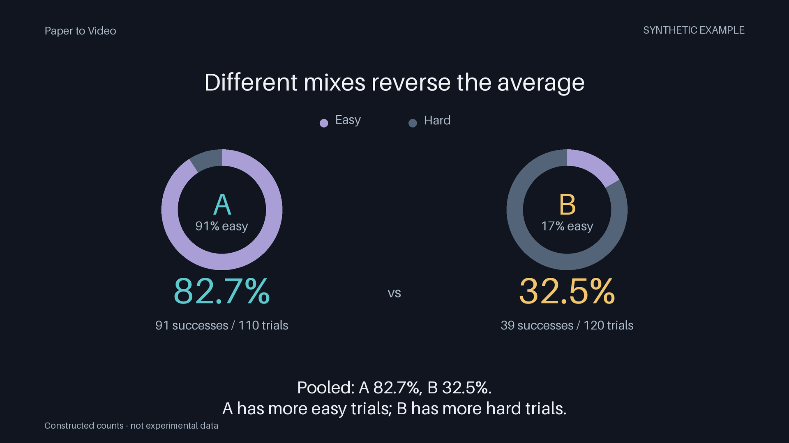

# Paper to Video Skill

[English](README.md) · 简体中文

把科研论文制作成清楚、有层次的动画解说：实质主张对应来源，每个画面围绕一个重点展开。

**v0.1-alpha：** Agent 制作工作流，加一个原创、可复现的短演示。安装 skill 并不等于获得任意 PDF 自动成片的引擎。

[](docs/media/demo.mp4)

[观看 48 秒演示](docs/media/demo.mp4) · 下载后可打开[本地预览页](docs/demo.html)。

演示以深色背景和逐步展开的图表解释辛普森悖论。文章和数据均为合成教学材料，不是真实实验结果。成片为 1920×1080、24 fps，画面内含英文字幕；默认无声，也可加入自行授权的音轨。

## 包内有什么

| 内容 | 能力范围 |
|---|---|
| [Agent skill](skills/paper-to-video/SKILL.md) | 来源复核、主张绑定、讲稿、视觉设计、配音与字幕同步、交付检查。宿主 Agent 使用其实际可用的工具执行。 |
| [项目接口](skills/paper-to-video/references/project-interface.md) | 导入 UTF-8 文本或已有 Reader 卡，检查来源引文与分镜引用；仅依赖 Python 标准库。 |
| [可运行短演示](examples/simpson/render_demo.py) | 无需 API Key，在本地渲染随包教学案例。这是该案例的专用绘图器，不是通用论文渲染器。 |

## 安装 skill

将完整的 `skills/paper-to-video` 文件夹，包括参考文档和脚本，复制到宿主支持的技能目录。

在本地 Codex 中，可放入 `<你的项目>/.agents/skills/paper-to-video` 或 `~/.agents/skills/paper-to-video`。如果没有出现，刷新或重启。目录规则见 [OpenAI 官方技能文档](https://learn.chatgpt.com/docs/build-skills)。

仓库发布后，也可请 Codex 的 skill installer 从实际仓库地址安装 `paper-to-video`，技能路径为 `skills/paper-to-video`。请填入真实发布地址；本包没有预设仓库所有者。

安装后可以这样提出请求：

> 使用 paper-to-video skill，为目标读者讲解这篇文章。先检查来源和可用工具，再建立主张与证据对应表，并制作一段视觉小样。时长由内容决定。完整制作前，指出需要人工核对的结论和科学结构。

宿主 Agent 需要文件访问和适合的执行工具。PDF 解析、字体、编码器、模型及 TTS 服务属于独立环境依赖，安装技能不会自动提供这些资源。

README 提供英文和中文两个版本；skill 内的详细指令和参考文档目前主要为中文。

## 运行短演示

使用 Python 3.10+，在下载后的仓库根目录运行。这个案例无需 Agent 或云服务账户。

```bash
python -m pip install -r requirements-demo.txt
python examples/simpson/render_demo.py --output outputs/demo.mp4
```

依赖为 `Pillow>=10.1,<13` 和 `imageio-ffmpeg>=0.6,<0.7`，后者提供视频编码器。安装依赖可能下载软件包；渲染过程不调用付费 API。运行时间取决于本机性能，尚未独立测试其他操作系统。

可选：加入已获授权、时长为 48 秒且与案例时间轴匹配的音轨：

```bash
python examples/simpson/render_demo.py --output outputs/demo-with-audio.mp4 --audio YOUR.wav
```

此选项只添加音轨，不合成语音，也不会自动把任意旁白与字幕对齐。默认字幕使用案例预设时间轴；另附 [SRT](examples/simpson/subtitles.en.srt) 和[讲稿](examples/simpson/narration.en.md)，方便准备匹配的配音。

可编辑来源包括 [article.txt](examples/simpson/article.txt)、[data.json](examples/simpson/data.json) 和 [project.json](examples/simpson/project.json)。演示由这些原始数据和绘图规则决定；字体和编码器版本可能改变具体外观及文件字节。

已完成与尚未执行的检查见 [REPRODUCIBILITY.md](docs/REPRODUCIBILITY.md)。可自行运行来源与数据检查：

```bash
python -B -m unittest discover -s tests -v
python -B scripts/verify_package.py
```

## 建立单篇项目

将已有 UTF-8 文本导入新项目记录，再检查基础契约：

```bash
python skills/paper-to-video/scripts/project.py init examples/simpson/article.txt outputs/project.json --format text --article-type theoretical
python skills/paper-to-video/scripts/project.py validate outputs/project.json
```

输出文件必须尚不存在。初始化只记录来源，不自动生成已核对的主张、分镜或视频。按[项目接口文档](skills/paper-to-video/references/project-interface.md)添加真实引文和审核状态。接口也接受已有 Reader 卡；PDF 仍需先用上游工具解析。

## 能力边界与复查

当前演示的是随包文本与数据 → 预设动画 → MP4。处理新论文时，宿主 Agent 仍需实现各制作步骤；本包没有统一的任意 PDF 解析器、TTS 适配器、自动对齐服务或通用渲染命令。

`contract_valid` 检查基础数据和引用。`evidence_ready` 结合结构检查与填写的人工审核状态，不代表独立科学审计。项目验证器的 `video_ready` 当前始终为 `false`，因为音频、时间轴、渲染及最终听看检查尚未接入该接口；单独导出演示视频不会改变这一状态。

真实论文需要对照来源核对科学主张与图中结构，并实际听看编码后的成片。片长由材料和实测旁白决定，不固定套用时长。论文、图片和声音各有独立使用权限；私人阅读授权不等于公开分发授权。

## 参与改进

见 [CONTRIBUTING.md](CONTRIBUTING.md)。欢迎提供可复现的安装报告、引用检查失败样例，或其他领域的小型公开案例。请附输入、预期行为、环境和最小复现步骤，只分享有权分发的材料。

## 许可

**License pending author confirmation（许可证待作者确认）。** 当前发布候选包尚未授予开源许可，具体见 [RIGHTS.md](RIGHTS.md)。依赖软件的许可，以及未来论文和声音素材的权利，分别核验。
